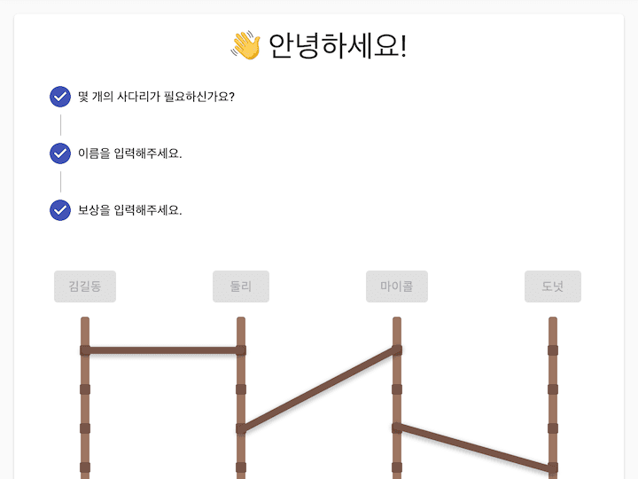

[demo]: https://ladder.divlook.dev/
[github]: https://github.com/divlook/ladder-game/
[wiki]: https://github.com/divlook/ladder-game/wiki/

# README

## 소개

[Ladder Game][github]은 웹사이트에서 간단하게 사다리 게임을 하기 위해 만든 토이 프로젝트입니다. 아직 완성되지는 않았지만 1차적으로 구현하려고 했던 기능들이 완료되어 소스를 공개합니다.

[Demo][demo] 이 링크를 클릭하여 지금 바로 사다리 게임을 할 수 있습니다. 데스크탑 웹과 모바일 웹을 모두 지원하지만, Internet Explorer(이하 IE)는 버전 11이상만 호환됩니다. IE 버전 10이하는 사용하는데 문제가 있을 수 있으니 최신 브라우저를 사용해주세요.

## 문서

- [Wiki](https://github.com/divlook/ladder-game/wiki/)

- [미리보기](https://ladder.divlook.dev/)

- [소개 및 기술 스택](https://github.com/divlook/ladder-game/blob/master/README.md)

- [개발 후기 (v0.1.3)](https://github.com/divlook/ladder-game/wiki/v0.1.3)
